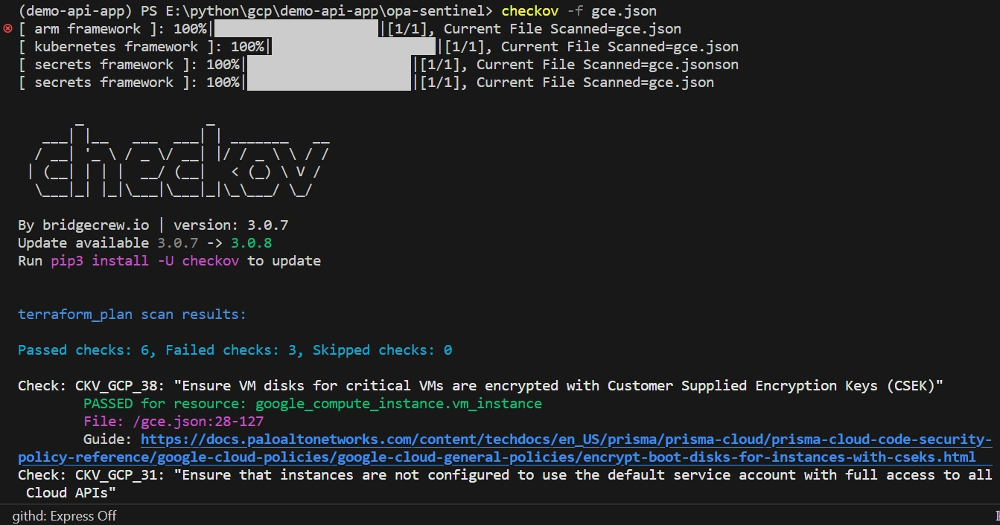

# Opa with Python and Open Source Tools
A repo to demo a simple workflow from performing Terraform IaC tasks to using Opa PaC to evaluate a rego policy.

In addition, Python, gcloud and other vendor's Open Source tools for PaC (Policy-as-Code) also play necessary roles in Google Cloud.

## Local setup
This repo is by no means to be used for production environment.
The objective is to demonstrate how python, terraform and opa workflow to achieve IaC and PaC outcomes.

A simple terraform plan to create a GCE instance to existing VPC Network and Subnet with external IP address/netowrk interface in europe-west-2 (London) region.

You can choose to have a key.json for the default GCE Service Account to facilitate local development setup to access to Google Cloud. Note that the json file must be excluded from git push using .gitignore.

## gcloud and terraform setup
Please perform the usual: gcloud auth login and gcloud config list to ensure you have the correct default project, region and login. In case you are using key.json of a Service Account, please store it in a secure location of your choice.

Terraform can be checked with : terraform version - command

There are 2 simple terraform files:
- provider.tf  -- use the newer required_providers block
- gce.tf -- is the file to create a vm instance to existing VPC and Subnet in europe-west-2

Do the following in sequence:
- terraform fmt
- terraform init
- terraform plan --out gceplan
- terraform show -json gceplan
- terraform apply

By the end, you will have a running VM instance in the VPC/Subnet specified.

## Get the JSON Objects from terraform plan

However, our objective is to infuse 'Shift-left' DevSecOps paradigm to this workflow.
Let us focus on how to incorporate opa into validation of the terraform plan after you have the terraform plan in json and before you apply the terraform changes.

With terraform show -json command, the plan is easily be converted to a JSON file.
In this repo, the gce.json is the resulting file.

The python file extract.py will extract the necessary JSON object within the nested/parent object.
In fact, the python code also compares the actual value under this key with a simple list to simulate what can be done to validate a policy using python.  __A message will indicate whether the target machine_type is "allowed or forbidden"__ 

In this case, the key is 'machine_type'.
To continue with setting up for a demo opa evaluation, 

(a) I quickly made a simple JSON file from the key/value pair:

    {'machine_type': 'n1-standard-1'}

    and named it machine.json.

(b) In addition, a simple rego file __gcp2.rego__ is created with the same list as in the extract.py : 
    only allow 2 machine_types and modify the variable 'deny' according to the input json file.

(c) Finally, opa.exe for Windows is also available to the repo directory 
    (but it is excluded from git push).

(d) Now we can run the opa evaluation to query the 'deny' variable status, assuming Windows is being used:

   **.\opa.exe eval --data .\gcp2.rego --input .\machine.json "data.machine.deny"**

   The terminal output will be as follows:

## Next level ##

As seen above, evaluating a simple policy is straightforward when you have all the necessary configuration (input and data for opa) from terraform.

In reality, the policies are much more complex in order to put in the Guardrails for each stage of GitOps with CICD pipelines (using maybe Google Cloud Build, Jenkins etc).

Opa has a community to provide various policies to be shared, though they are not necessarily for GCP or for your purposes.

But as there is a need, there are solutions.

(a) Hashicorp developed Sentinel to work along with Terraform. It's natural for them to integrate PaC with their successful Terraform IaC.  They have policies for GCP Compute, Networking, Database and Storage :

https://github.com/hashicorp/policy-library-gcp-compute-terraform

https://github.com/hashicorp/policy-library-gcp-networking-terraform

etc and I expect more to come in the future.
Detailed documentation of how to use Sentinel can be found on Hashicorp.

(b) Google Cloud Platform - the Github repo for all the available constraints/policies is as follows:

https://github.com/GoogleCloudPlatform/policy-library

(c) Prisma Cloud - by Palo Alto

As part of their CSPM functionalities and extensions, Prisma Cloud has Open Source tool, checkov: 

https://www.checkov.io/

https://github.com/bridgecrewio/checkov

which is easy to install (pip install) and give you more checks from current best security practices.
For trivy or/and docker scout users, the output from chekov will look very familiar.

(d) gcloud and python

The powerful Organization Policy should not be a stranger to GCP Engineer/Architect. In fact, gcloud commands will provide you loads of information regarding the complex setup of organization policies, Heirarchical Firewall Policies (on top of firewall rules) and VPC networks. This gives you the basis for the first draft of rego policies and a top-down approach to ensure consistent Security Posture.

In addition, Python is becoming the new swiss knife for all general purpose scripting instead of the good old bash. 

(e) In addition, there are more tools available than the above. Even Configuration Management tools such as Ansible (Automation Platform) and Chef (Inspec) can be and have been used as policy validation for quite a long while.

## Conclusion ##

Cloud Security Posture Management is a mandatory effort if any organization wants to deploy their applications on any cloud platforms.

DevSecOps will be a critical component to ensure security risks and threats are minimized during cloud adoption and deployments.

Opa is a nice CNCF graduated Security and Compliance project. It is cross-platform and extends into kubernetes, making it a very useful tool to DevSecOps.

Other open source tools are also available to compliment each other in order to create a full picture to evaluate the threats and intricacy of security/compliance challenges on the cloud.

